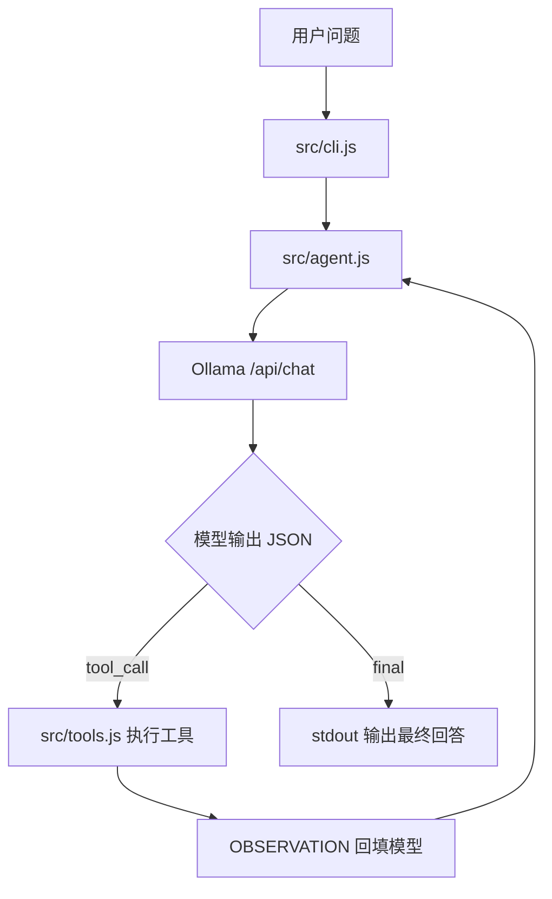

# LLM-Agent 示例架构

## 目标

这个项目用最少代码解释 LLM-Agent 的核心机制：模型不是直接执行工具，而是输出结构化动作；程序负责解析动作、执行工具、回填观察结果。

## 运行链路



## 模块职责

| 文件 | 职责 |
|---|---|
| `src/cli.js` | CLI 入口，读取问题，打印过程日志和最终答案 |
| `src/agent.js` | Agent loop，控制最多 5 轮调用、重试和观察结果回填 |
| `src/ollama-client.js` | 封装 Ollama API，支持本地和远程 `OLLAMA_HOST` |
| `src/tools.js` | 工具实现：当前时间、计算器、本地知识库搜索 |
| `src/protocol.js` | 解析模型返回的 JSON 协议，处理非法 JSON |
| `prompts/system.md` | 约束模型只输出 `tool_call` 或 `final` |
| `data/notes.md` | 示例知识库，供 `search_notes` 搜索 |

## 为什么不用框架

第一版不引入 LangChain、数据库或 Web UI。原因是学习重点在 agent loop：

1. 模型输出结构化动作。
2. 程序校验动作。
3. 程序执行工具。
4. 工具结果作为 observation 回填。
5. 模型继续直到 final。

理解这 5 步之后，再接 LangChain、MCP、RAG 或 Web 服务会更清楚。

## 本地和测试环境切换

默认本地：

```bash
OLLAMA_HOST=http://127.0.0.1:11434 OLLAMA_MODEL=qwen2.5:7b npm run ask -- "问题"
```

后续测试环境 Docker 暴露 Ollama 端口后，只改 host：

```bash
OLLAMA_HOST=http://127.0.0.1:<port> OLLAMA_MODEL=qwen2.5:7b npm run ask -- "问题"
```

测试环境注意事项：

- 模型文件建议放 `/data9`，不要放根分区。
- 测试机没有 NVIDIA GPU 时，CPU-only 推理可能比较慢。
- 远程端口暴露前要确认访问控制，避免把模型接口公开到不可信网络。
