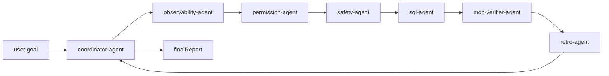

# Day56 完整多 Agent 工程闭环 Capstone

这篇文档解释 day56 为什么作为最终综合练习存在。day02 负责让你理解多 agent 协作的基本形态；day56 负责把 day41-day55 的生产工程能力串成一个可审计闭环。

## 角色边界

| Agent | 输入 | 输出 | 禁止做的事 |
|---|---|---|---|
| coordinator-agent | 用户目标、各 agent 结果 | handoff 顺序、最终 decision、finalReport | 直接执行命令、绕过权限、替其它 agent 下结论 |
| observability-agent | mock Grafana/Prometheus/log/trace snapshot | 观测证据可信度 | 把 403、旧数据或 HTML 错页当业务故障 |
| permission-agent | mock 用户 header、权限缓存、ACL snapshot | allowed / blocked 和阻断原因 | 用 api token 覆盖真实用户身份 |
| safety-agent | mock 远程命令请求 | blocked / pending-approval / dry-run | 执行 SSH、systemctl、kubectl 或 shell |
| sql-agent | mock SQL 修复请求 | SQL 草案、回滚 SQL、风险说明 | 连接数据库或执行 SQL |
| mcp-verifier-agent | mock MCP endpoint 和协议结果 | /mcp + initialize + tools/list 验真结论 | 把 /health、/sse 或根 URL 当 MCP |
| retro-agent | mock 事故复盘草案 | 质量检查和脱敏结论 | 放过 token/password/client_secret 泄露 |

## Handoff 顺序



权限失败会在 `permission-agent` 后停止；高危命令会在 `safety-agent` 后停止。其它质量问题会继续汇总到 `unresolvedRisks`，但不会标记为 ready。

## 共享 Evidence Board

day56 的 CLI 输出固定 JSON 字段：

```text
day, title, localOnly, runId, agents, handoffs, evidenceBoard, decision, finalReport, unresolvedRisks
```

`evidenceBoard` 是所有 agent 的共享事实层。它避免每个 agent 只输出一段自然语言结论，方便人复核：

- 观测证据是否新鲜、协议是否正确。
- 权限缓存、ACL snapshot 和真实用户身份是否一致。
- 远程命令是否改变状态，是否需要人工审批。
- SQL 是否包含 `SELECT ... FOR UPDATE`、回滚 SQL 和不可执行边界。
- MCP 是否通过 `/mcp`、initialize、`tools/list`。
- 复盘是否包含时间线、影响面、根因、证据、修复、预防项和脱敏。

## 失败恢复

- 权限缓存缺失：停止进入执行阶段，提示补齐 Redis 用户权限缓存或 ACL snapshot。
- 高危命令：直接 blocked，不进入审批。
- 状态变更命令：只生成审批草案，`commandExecuted=false`。
- SQL 条件不足：拒绝生成 UPDATE，要求补齐 id 列表。
- MCP 路径错误：即使 `/health` 或 `/sse` 可访问，也判定为 wrong endpoint。
- 复盘缺预防项或泄露 token：final report 不允许 ready。

## 为什么模型不能直接决定权限、执行和 SQL

模型适合做总结、草稿和解释；权限、远程执行和 SQL 都是确定性风险边界，必须由代码控制。

- 权限：必须基于真实用户、缓存和 ACL snapshot，而不是模型猜测“应该有权限”。
- 执行：命令一旦真实执行就会改变环境，必须经过灾难性命令拦截、审批和审计。
- SQL：数据库修改必须有事务、锁定查询、回滚 SQL、影响行数判断和 DBA 审核。
- MCP：工具注册前必须完成协议验真，否则 Agent 可能调用一个看似可访问但不可用的入口。

day56 的最终状态是 `ready-for-human-review`，不是自动修复完成。这一点是生产工程 Agent 的核心边界。
