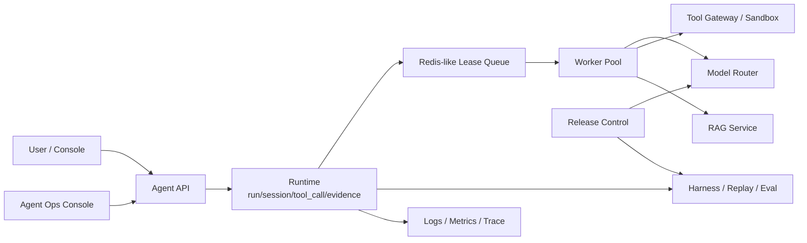

# Agent Platform System Design

这份文档把 day57-day65 串成一个面试可讲的系统设计版本。

## 总架构



## 核心组件

| 组件 | 对应 day | 职责 |
|---|---|---|
| Runtime | day57 | run/session/tool_call/evidence 状态机、取消、重试、超时、恢复、幂等和并发控制。 |
| Harness | day58 | replay、compare、golden dataset、CI gate 和质量指标。 |
| RAG | day59 | ingestion、chunk、embedding、hybrid search、rerank、citation、权限过滤和 recall eval。 |
| Product Console | day60 | run 列表、timeline、tool approval、citation、evidence board、final report。 |
| Sandbox | day61 | prompt injection、tool output trust boundary、PII/secret、网络/文件/tool/MCP allowlist。 |
| Orchestration | day62 | DAG、fan-out/fan-in、共享状态冲突、partial failure、预算、超时和取消。 |
| Release | day63 | prompt/model/tool/spec 版本、shadow、canary、gray、rollback。 |
| Model Router | day64 | provider 统一接口、streaming、tool calling、JSON schema、retry、timeout、cost、fallback。 |
| Multimodal | day65 | 图片、语音、视频理解和多模态 eval。 |

## 数据模型

- `run`：一次用户目标执行，包含状态、actor、tenant、idempotency key。
- `session`：上下文窗口、短期历史和审计关联。
- `tool_call`：工具名、参数、风险、审批状态、输出摘要。
- `evidence`：可审计证据，包含 source、timestamp、redaction 状态。
- `eval_result`：golden case、replay snapshot、指标和 gate 结论。
- `version`：prompt/model/tool/spec 的不可变快照。

## 关键边界

- 权限过滤在工具和 RAG 层由代码执行，不能交给模型总结阶段。
- 远程命令、SQL、文件写入、网络访问必须进入 sandbox 和 approval。
- 模型 provider fallback 由 router 决定，不写在 prompt 中。
- 发布灰度由指标触发，模型不能自己决定上线或回滚。
- 最终报告默认 `ready-for-human-review`，不自动执行修复。

## 可运行路径

```bash
# 用途：验证 day57-day65 生产级能力补强
# 执行目录：项目根目录
# 结果判断：所有新增 day 打印 tests passed
# 风险：默认 mock/内存，不启动真实 Docker 或模型服务
npm run day57:test && npm run day58:test && npm run day59:test && npm run day60:test && npm run day61:test && npm run day62:test && npm run day63:test && npm run day64:test && npm run day65:test
```
